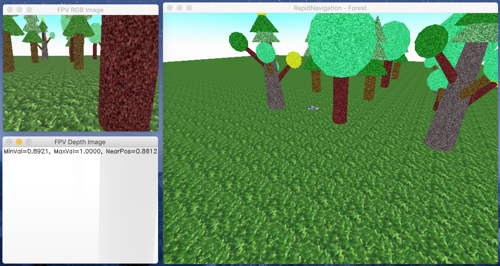
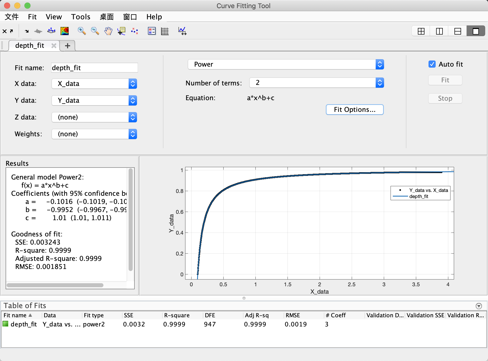

## PyRealSim
- **Author:** LIU-Yinyi
- **Date:** 2020-01-31
- **Version:** 0.8.0
- **Abstract:** A quadcopter navigation simulator with built-in physics engine and sensor emulation including 6-DoF gyro and RGB-D camera based on Panda3D.

---

### 1. Prerequisites
You had better install `conda` for virtual environment. Also you have to install [Panda3D-SDK](https://panda3d.org/) for essential 3d rendering. After above you should install `python 3.6+` interpretator and `opencv-python` library. Use `pip` to setup dependency.

```bash
git clone https://github.com/LIU-Yinyi/PyRealSim.git
cd PyRealSim
pip install -r requirements.txt
```

Test if the installation is successful:

```bash
# under Linux or MacOSX
python main.py

# under Windows Environment
ppython main.py
```

If everything goes well, you will see:




### 2. Interfaces
You can use `Matlab` m-Files interface functions in `./api` directory. Type the instruction in matlab console with Enter, help and notes will display. Just follow the usages you can communicate with the `PyRealSim` through `UDP Protocol`. If something goes wrong, check if the port at `6666` and `6688` are occupied.

Other APIs are developing hitherto. Final release will be available at `version 1.x`.

### 3. Problems
But now I wonder how to understand the result of the depth image which is specified as CV_32FC1 format for each pixel. A ball was used to test the pixel value with respect to distance between the camera and the ball. Result was drawn below by Matlab where seemed a bit strange… The relationship between pixel-value and distance is not linear. I used tool to fit and the equation `y=a*x^b+c` where `a=-0.1016, b=-0.9952, c=1.01`. Also the parameters showed kind of relevance with camera lens.

