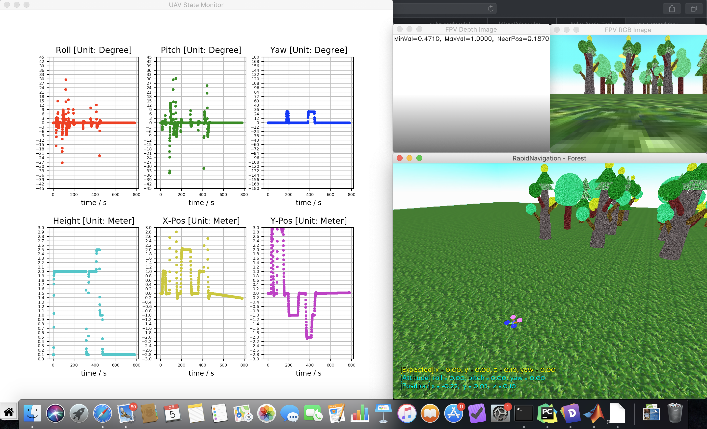
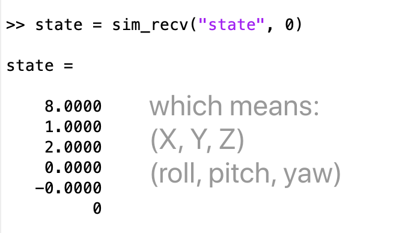
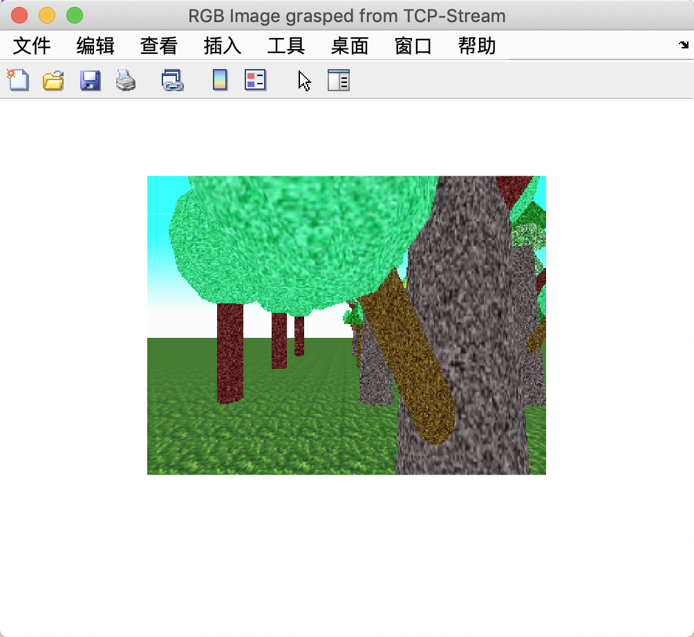
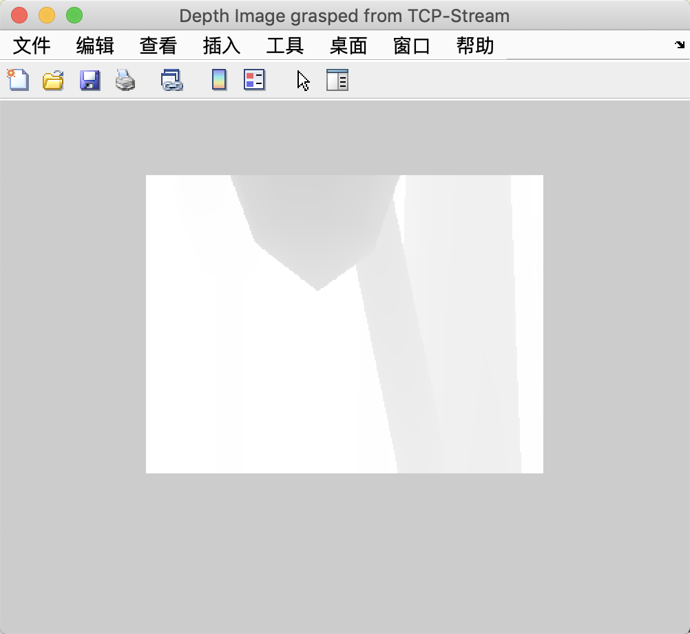

## PyRealSim
- **Author:** LIU-Yinyi
- **Date:** 2020-02-10
- **Version:** 1.0.0
- **Abstract:** A quadcopter navigation simulator with built-in physics engine and sensor emulation including 6-DoF gyro and RGB-D camera based on Panda3D.

---

### 1. Prerequisites
You had better install `conda` for virtual environment. Also you have to install [Panda3D-SDK](https://panda3d.org/) for essential 3d rendering. After above you should install `python 3.6+` interpretator and `opencv-python` library. Use `pip` to setup dependency.

```bash
git clone https://github.com/LIU-Yinyi/PyRealSim.git
cd PyRealSim
pip install -r requirements.txt
```

Test if the installation is successful:

```bash
# under Linux or MacOSX
python main.py

# under Windows Environment
ppython main.py
```

If everything goes well, you will see:




### 2. Interfaces
You can use `Matlab` m-Files interface functions in `./api` directory. Type the instruction in matlab console with Enter, help and notes will display. Just follow the usages you can communicate with the `PyRealSim` through `UDP/TCP Protocol`. If something goes wrong, check if the ports from `6666` to `6668` are occupied.

Note that I release the `1.0.0` formal APIs, which are more compatible:

#### 1. save the socket variable in base workspace automatically

```matlab
sim_init
```

#### 2. formal API won't require sockfd variable, and id becomes independent

```matlab
sim_send(cmd, id, dat)

% @note: required previous call from sim_init
% @param cmd: (1)update (2)control
% @param id: target uav id (-1 means all)
% @param dat: [x, y, z, yaw]
% @example: sim_send('control', 0, [1, 0, 1, 0]);
%    which means: id = 0, set x = 1, y = 0, z = 1, yaw = 0 (Radian)
```
   
#### 3. new APIs for acquiring UAVState and Images

```matlab
dat = sim_recv(cmd, id)

% @note: required previous call from sim_init
% @param cmd: (1)state (2)rgb (3)depth
% @param id: target uav id (-1 means all)
% @example: dat = sim_recv('rgb', 0);
%    which means: receive image data of RGB image from UAV-0
```

for example, use like above:

<center></center>

also, it is also convenient to acquire image:

<center></center>

so does the depth image:

<center></center>

#### 4. easily release ports

```matlab
sim_quit
```

**WARNING:** Use `sim_init` will create *sockfd_sender*, *sockfd_recver*, *sockfd_imager* three objects in base workspace. Make sure you are not going to name your own variables that conflict with them, or the networks connections might go wrong.

### 3. Troubleshots
But now I wonder how to understand the result of the depth image which is specified as CV_32FC1 format for each pixel. A ball was used to test the pixel value with respect to distance between the camera and the ball. Result was drawn below by Matlab where seemed a bit strange… The relationship between pixel-value and distance is not linear. I used tool to fit and the equation `y=a*x^b+c` where `a=-0.1016, b=-0.9952, c=1.01`. Also the parameters showed kind of relevance with camera lens. If you want to get linear depth, please use custom shader to render. Or you can search *Linear Depth* on Google for conversion between Lens Parameters and Non-Linear Depth Equation.


Note that the verified environment was the `Mac OSX Mojave 10.14.6` with `Matlab R2019b`, but I think other platform might also work well. If anything wrong, please feel free to tell me or submit an issue on Github.